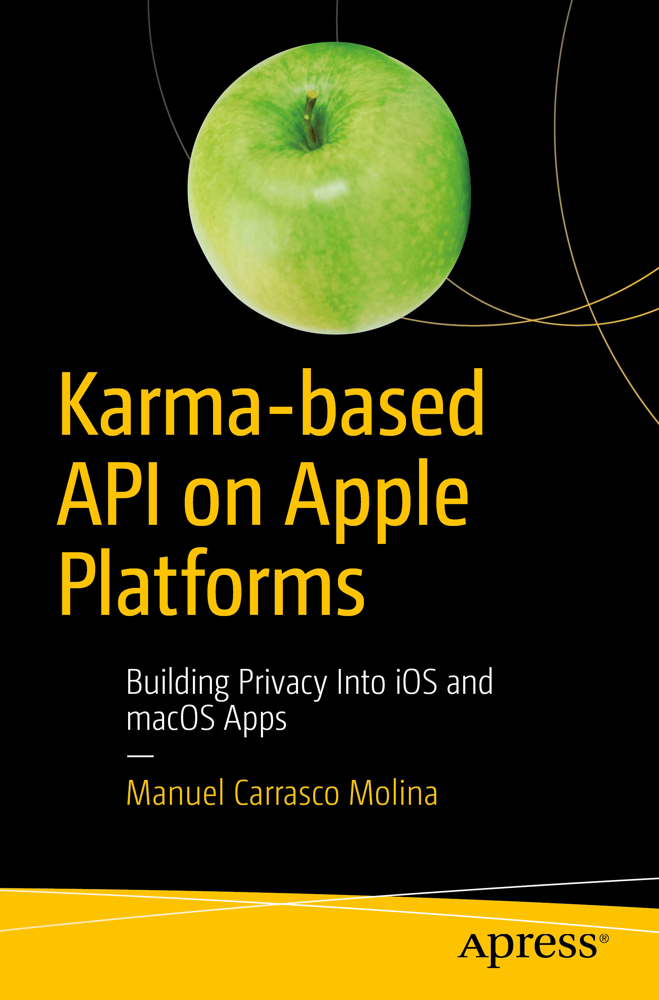

# Apress Source Code

This repository accompanies [*Karma-based API on Apple Platforms: Building Privacy Into iOS and macOS Apps*](https://www.apress.com/9781484242902) by Manuel [@StuFFmc](https://twitter.com/stuffmc) Carrasco Molina (Apress, 2019).

[comment]: #cover

Download the files as a zip using the green button, or clone the repository to your machine using Git.

## Releases

Release v1.0 corresponds to the code in the published book, without corrections or updates.

## Contributions

See the file [Contributing.md](Contributing.md) for more information on how you can contribute to this repository.